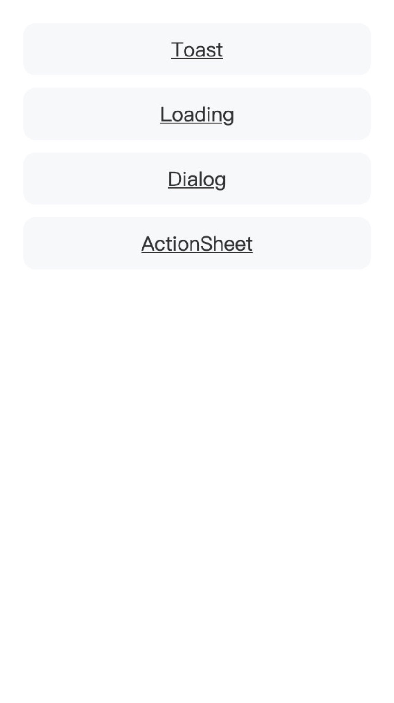
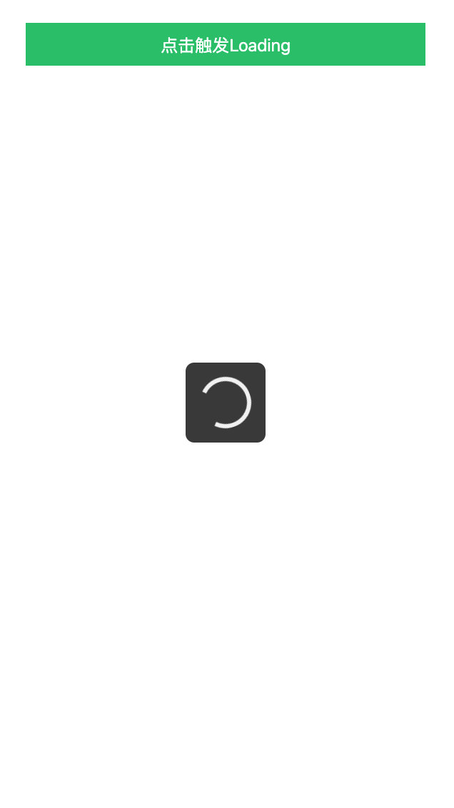

# mini-uikit

Mini-Uikit 是基于原生 js 实现，不依赖任何框架，是一款轻量高频的 ui 组件库; 该 ui 库内部封装了一些使用频率较高的组件，使用场景偏向一些简单的 H5 移动端项目，主要目的是为了规避当使用这些组件时而引入一个大而全的 UI 库。

## Example

<table>
  <tbody>
    <tr>
      <td>
        
        <p align="center">List</p>
      </td>
      <td>
        
        <p align="center">Toast</p>
      </td>
      <td>
        
        <p align="center">Loading</p>
      </td>
      <td>
        
        <p align="center">Dialog</p>
      </td>
      <td>
        
        <p align="center">ActionSheet</p>
      </td>
    </tr>
  </tbody>
</table>

## Getting Started

### Installation

```bash
$ npm install mini-uikit -S
or
$ yarn add mini-uikit -S

```

### Usage

模块化方式引入

```js
import * as uikit from 'mini-uikit'
import 'mini-uikit/lib/lib.css'

uikit.loading.show()
setTimeout(() => {
  uikit.loading.hide()
}, 1500)
uikit.toast.showTop('测试')
uikit.actionsheet(...options) // options: title, options, onCancel, hideCancel, cancelBtnText
uikit.alert('测试', 'test')

```

使用 CDN 引入

```html
<link href="https://unpkg.com/mini-uikit@0.0.1/dist/lib.css">
<script src="https://unpkg.com/mini-uikit@0.0.1/dist/index.js"></script>

<script>
  uikit.loading.show()
  setTimeout(() => {
    uikit.loading.hide()
  }, 1500)
  uikit.toast.showTop('测试')
  uikit.actionsheet({/* options */})
  uikit.dialog.alert('测试', 'test')
</script>
```

### API

#### Loading

`uikit.loading.show()`

```js
import * as uikit from 'mini-uikit'

uikit.loading.show()

setTimeout(() => {
  uikit.loading.hide()
}, 2000)
```

#### Toast

`uikit.toast.showTop(options)`

options:

- content: `string` 必选
- time: `number` 显示毫秒数，默认 1800，可选
- cb: `function` toast 结束后的回调，可选

```js
import * as uikit from 'mini-uikit'

// demo 1.
uikit.toast.showTop('test')

// demo 2.
uikit.toast.showCenter('test', 5000)

// demo 3.
uikit.toast.showBottom('test', 2000, () => {
// callback
})
```

#### ActionSheet

`uikit.actionsheet(options)`

options:

- title: `string`， 可选
- options: `array`， 必选， 选项数组， 每一项包含 text、disable、destructive、onSelect
- onCancel: `function`，可选，指定取消按钮回调函数
- hideCancel: `boolean`，可选，是否隐藏取消按钮
- cancelBtnText: `string`，可选，默认值是 “取消”

```js
import * as uikit from 'mini-uikit'

uikit.actionsheet('标题', [
    {
      text: '选项 1',
      disable: false,
      onSelect: (i, text) => {}
    },
    {
      text: '选项 2',
      disable: true
    },
    {
      text: '选项 3',
      destructive: true,
      onSelect: (i, text) => {
      }
    }
  ],
  onCancel() {
    // 取消回调函数
  },
  false,
  '关闭'
})
```

#### Dialog

##### Api 示例

```js
// alert 用法
uikit.dialog.alert(title, content, btns)

// confirm 用法
uikit.dialog.confirm(title, content, btns)

// 手动隐藏对话框
uikit.dialog.hide()

```

options:

- title: `string`， 可选
- content: string，必选
- btns: `array | function`，可选（btns 结构：{ text: String, onClick: Function }）

```js
import * as uikit from 'mini-uikit'

// demo 1.
uikit.dialog.alert('标题 1', '内容 1')

// demo 2.
uikit.dialog.confirm(
  '标题 2',
  '内容 2',
  (result) => {
    if (result) {
      // 确定回调逻辑
    } esle {
      // 取消回调逻辑
    }
  }
)

// demo 3.
uikit.dialog.alert('标题 3', '自定义按钮', [
  {
    text: '否',
    onClick: () {
      console.log('no')
    }
  },
  {
    text: '是',
    onClick: () {
      console.log('yes')
    }
  }
])

```

## Quick Start

```bash
git clone https://github.com/cy920820/mini-uikit
cd mini-uikit
npm install // or yarn
npm run start // or yarn start
```
